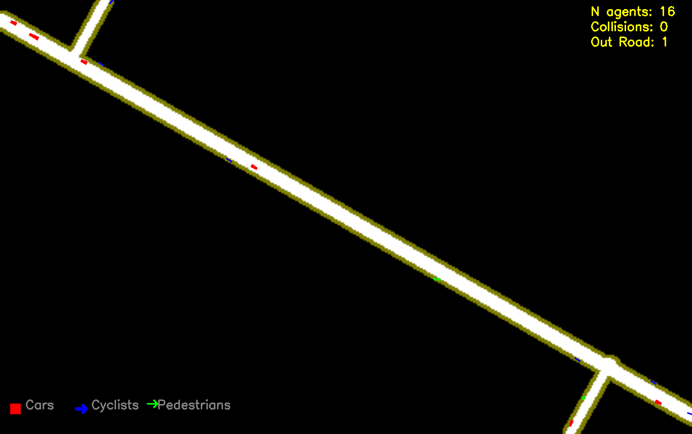
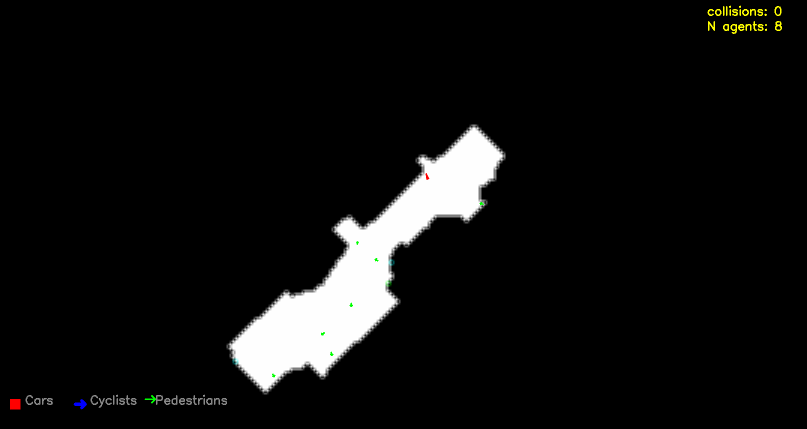

**Generizable, Heterogeneous Multi-Agent Traffic Simulator (MATS)**
===========================================================


The Generizable Heterogeneous Multi-Agent Traffic Simulator (MATS) is a novel tool to gamify real traffic by utilizing a digital-twin of real traffic scenes. The proposed model here leverages both Supervised and Reinforcement Learning techniques to model complex traffic scenarios with scalabilty and realism.

**Key Features:**

* **Generizability**: Robustly tested on two distinct environments:
	+ Intersections
	+ Shared spaces
* **Heterogeneity**: Simulates the behavior of multiple types of agents, namely:
	+ Vehicles
	+ Pedestrians
	+ Cyclists
* **Multi-Agent**: Enables simultaneous stepping for all agents with a short prediction horizon of 400 ms using parameter sharing
* **Realism**: Trained on real traffic trajectories to imitate it in both short-term (with supervised learning) and long-term (with reinforcement learning)


<p align="center" style="background-color:white;">
  
</p>

The provided codebase includes comprehensive scripts for both model training and simulation. The latter can be executed independently to test various multi-agent traffic models, empowering new works to explore and validate different Multi-agent Reinforcement Learning (MARL) algorthems.


## Videos of Simulation Results


The following are video demonstrations of MATS, for increasing number of agents (up to 96) in both environement. Counters for collisions and moving outside the road are shown.

<!---->

<table>
  <thead>
    <tr>
      <th><center>Shared Space Case</center></th>
      <th><center>Intersection Case</center></th>
    </tr>
  </thead>
  <tbody>
    <tr>
      <td>
        
      </td>
      <td>
        
      </td>
    </tr>
  </tbody>
</table>


## Getting Started:

### Step 1
Clone the repo

### Step 2
Intsall dependices with: 

`pip install -r requirements.txt`

### Step 3

**Run the Trained Model**

To run the trained model and observe its behavior, navigate to either `unid_model` or `ind_model` and execute:

```bash
python trafficenv_D.py
```

### Step 4 (optional)

Additionally, to load and retrain the supervised learning model, it is possible to rerun `bc.py`, but the preprocessed numpy files are needed first.

These files can be generated by downloading the datasets of IND and UNID in `ind_model/indds` and `unid_model/unids` respectively. Then going through the code in the notebooks `ind_model/ind_preprocessing.ipynb` and `unid_model/unid_preprocessing.ipynb`. 


To view the prediction results and the preprocessed data, check the notebooks  `ind_model/draw_results.ipynb` and `unid_model/draw_results.ipynb`


## Citation:


*Will change later* 


```bibtex
@InProceedings{yousif2024,
    author="Yousif, Yasin and Müller, Jörg",
    title="Integrating Supervised and Reinforcement Learning for Heterogeneous Traffic Simulation",
    booktitle="Advances in Practical Applications of Agents, Multi-Agent Systems.",
    year="2024",
    publisher="Springer Nature Switzerland",
    address="Cham",
    note="To appear in November 2024"
}
```


## Help

If you need help, please create a new issue by clicking the "New issue" button on our repository's issue tracker page. Provide as much detail as possible about the issue you're experiencing, including:

* A clear description of the problem
* Any relevant code snippets or error messages
* The steps you've taken to troubleshoot the issue

