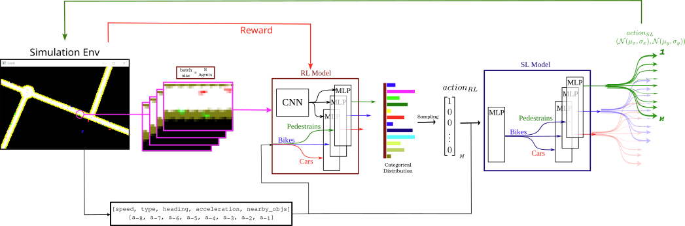
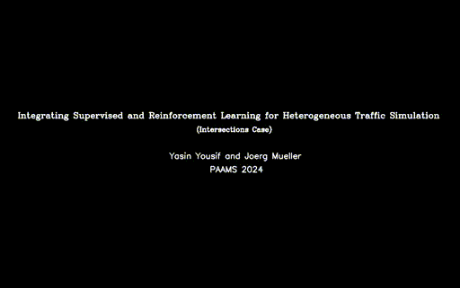

# Generlizable Hetergenous Realstic Multi-Agent Traffic Simulator (MATS) based on Supervised and Reinforcement learning.

- **Generlizable**: Tested on different traffic patterns of intersections and shared spaces
- **Hetergenous**: Modelling vehicles as well as pedestrains and cyclists
- **Multi-Agent**: Stepping for all agents at the same time for short prediction horizon of 400 ms
- **Realstic**: Using real traffic trajectoris to learn simulated trajectories on short term (supervised learning) and long term (reinforcement learning)


<p align="center" style="background-color:white;">
  
</p>


> The code contains both the models training scripts, as well as the simulators scripts. The latter can be used seprately to use different multi-agent traffic models


This work is related to the paper titled: 

<p align="center">
<b>Integrating Supervised and Reinforcement Learning for Heterogeneous Traffic Simulation</b>
</p>


## Installation:
`pip install -r requirements.txt`

Additionally, to load and retrain the supervised learning model, download  InD and UniD datasets from () and extract the .csv files into `/ind_model/indds` and `/unid_model/unids`

## Citation:

PDF of the paper is [avaliable here](paper.pdf)

*Will change later* 


```bibtex
@InProceedings{yousif2024,
    author="Yousif, Yasin and Müller, Jörg",
    title="Integrating Supervised and Reinforcement Learning for Heterogeneous Traffic Simulation",
    booktitle="Advances in Practical Applications of Agents, Multi-Agent Systems.",
    year="2024",
    publisher="Springer Nature Switzerland",
    address="Cham",
    note="To appear"
}
```


## Videos of the results:

**Intersection Case**




**Shared Space Case**


To run the trained model, just cd to either `unid_model` or `ind_model` and run:

`python trafficenv_D.py`


## Help

For discussing of issues and problems running the code, please consider creating an issue