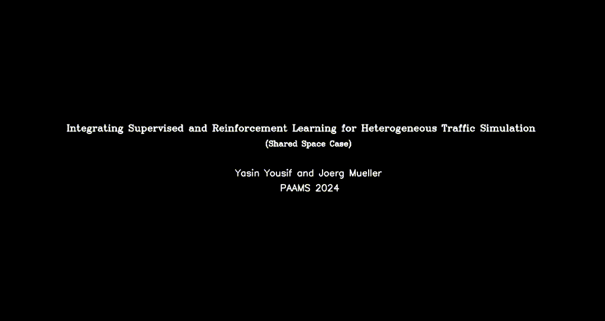

# Traffic Simulation for mixed traffic based on supervised learning models guided by reinforcement learning.


This code is related to the paper titled: 

<center>
<b>Integrating Supervised and Reinforcement Learning for Heterogeneous Traffic Simulation</b>
</center>

## Installation:
`pip install -r requirements.txt`

## Citation:

PDF of the paper is [avaliable here](paper.pdf)

*Will change later* 


```bibtex
@InProceedings{yousif2024,
    author="Yousif, Yasin and Müller, Jörg",
    title="Integrating Supervised and Reinforcement Learning for Heterogeneous Traffic Simulation",
    booktitle="Advances in Practical Applications of Agents, Multi-Agent Systems.",
    year="2024",
    publisher="Springer Nature Switzerland",
    address="Cham",
    note="To appear"
}
```


## Videos of the results:

**Intersection Case**


**Shared Space Case**




To run the trained model, just cd to either `unid_model` or `ind_model` and run:

`python trafficenv_D.py`


